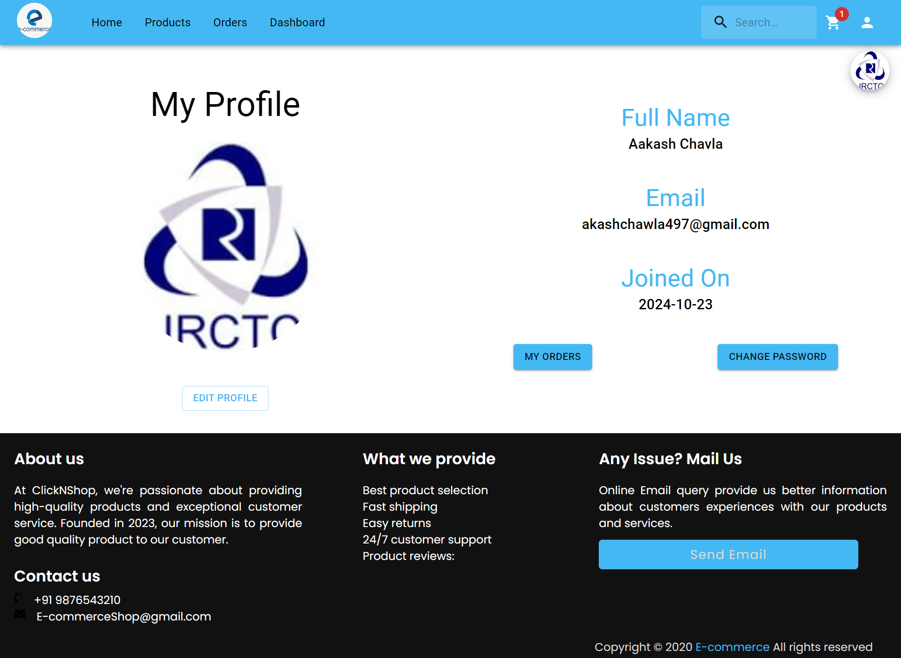

# PrimePicks Ecommerce

This is a E-commerce web site user can buy the product user can see its previous list of that was ordered.

<ul>
    <li>Sign Up Admin/User</li>
    <li>Sign In Admin/User</li>
    <li>Log Out</li>
    <li>Add Product</li>
    <li>Remove Product</li> <li>Cart</li>
    <li>Buy the product</li>
    <li>Track Product</li>
    <li>Admin Dashboard</li>
    <li>Order Detail</li>
    <li>Payment & Payment Gateway</li>
    <li></li>
    <li>See Previous Order</li>

</ul>

<H2>Prerequisites</H2>

<ul>
    <li>NodeJs</li>
    <li>ReactJs</li>
    <li>MongoDB</li>
    <li>ExpressJs</li>
    <li>Bootstrap</li>
</ul>

<H2>Screenshots<H2>

<h3>Home</h3>

<h3>Sign up</h3>

<h3>Login</h3>

<h3>Profile</h3>

<h3>Products</h3>

<h3>Cart</h3>

<h3>Order</h3>

<h3>Payment</h3>

<h3>Admin Panel</h3>

